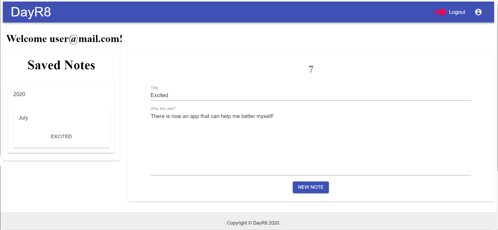

<h1 align= "center">DayR8</h1> 

<h3><a href= "https://dayr8.herokuapp.com/">Day-R8 Live Link</a></h3>  

## **Table of Contents**
<li><a href="#description">Description</a></li>  
<li><a href="#screen">ScreenShots</a></li> 
<li><a href="#usage">Usage</a></li> 

<li><a href="#tech">Technology Stack</a></li> 
<li><a href="#installation">Installation</a></li> 
<!-- <li><a href="#test">Test</a></li> -->

<li><a href="#contributors">Contributors</a></li>

<h2 id="description"> Description </h2>

Day-R8 (Day Rate), is an application that allows a user to journal their feelings and emotions each day, or throughout the day.

Tracking your daily emotions allows to:

<li>1. Allows user to see patterns in their life</li>
<li>2. Gives a user a better understanding possible triggers</li>
<li>3. Helps doctors to better pinpoint a better diagnosis</li>

## **Usage**  
As a new user to Day-R8, simply click the above "Live Link". Once the Day-R8 site is uploaded, click the "Sign Up".
**_A user must enter a valid email address and create a password of at least 8 characters._**
 On the slider scale, rate your day between 1-8. The user can type the emotion as the title for future reference. 
 Once the user is done with their journal entry _(or even a brief description)_, the save button must be clicked to record their entry.
 Each entry is saved, and the data ratings are charted and graphed. 
 The user is able to retrieve entries sorted by year and can also view an overall timeline of their emotions in a visual graph.

<h2 id="installation"> Installation </h2>

<h2 id="tech"> Technology Stack </h2>          
<ul>
<li>React</li>
<li>CSS / Material UI </li>
<li>JSX</li>
<li>JavaScript</li>
<li>Sequelize</li>
<li>MySql</li>
<li>Node JS</li>
<li>Express</li>
<li>NPM Packages: Passport/bCrypt, Validator for React, React-Charts, Axios, Moment </li><li></li>
</ul>          

<h2 id="screen"> ScreenShots </h2>
<h4> Desktop </h4>

<!--  -->
<!--  -->
<!--  -->
<!-- <h4> Mobile </h4> -->
<!--  -->
<!--  -->
<!--  -->
<!--  -->
<!--  -->
<!-- <h2 id="test"> Test </h2> -->
<!--  -->

<h2 id="contributors"> Contributors/ Contact</h2>
<h4><a href= "https://github.com/chaalexander">@chaalexander</a></h4>

<h5><a href= "https://chaalexander.github.io/">Portfolio</a></h5>  
<h5><a href= "mailto:charlennep@gmail.com">charlennep@gmail.com</a></h5>       
<h5><a href= "https://www.linkedin.com/in/cha-alexander">LinkedIn</a></h5>

<h4><a href= "https://github.com/garrettwgriffey">@garrettwgriffey</a></h4>

<h5><a href= "https://garrettwgriffey.github.io/">Portfolio</a></h5>  
<h5><a href= "mailto:garrettwgriffey@gmail.com">garrettwgriffey@gmail.com</a></h5>       
<h5><a href= "https://www.linkedin.com/in/garrettwgriffey/">LinkedIn</a></h5>

<h4><a href= "https://github.com/timothymickiewicz">@timothymickiewicz</a></h4>

<h5><a href= "https://timothymickiewicz.github.io/">Portfolio</a></h5>  
<h5><a href= "mailto:timothy.mickiewicz@gmail.com">timothy.mickiewicz@gmail.com</a></h5>       
<h5><a href= "https://www.linkedin.com/in/timothymickiewicz1995/">LinkedIn</a></h5>

<h4><a href= "https://github.com/git-theresa">@git-theresa</a></h4>

<h5><a href= "https://git-theresa.github.io/Portfolio/">Portfolio</a></h5>  
<h5><a href= "mailto:t.eatherly@gmail.com">t.eatherly@gmail.com</a></h5>       
<h5><a href= "https://www.linkedin.com/in/theresa-eatherly-4362b14a/">LinkedIn</a></h5>
